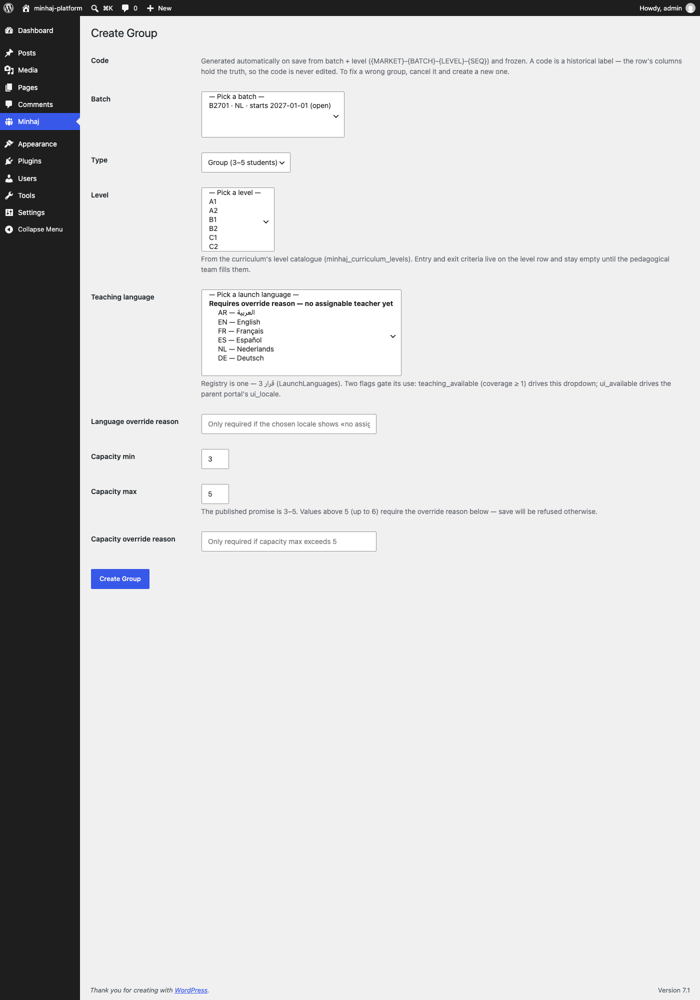
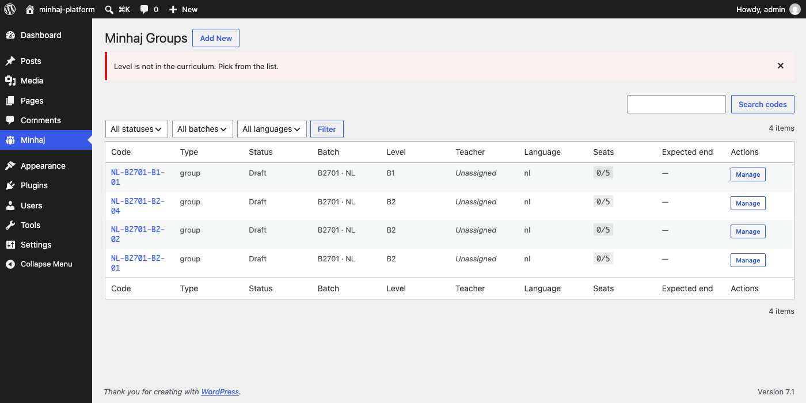

# تقرير · إغلاق جولة الواجهة — الرمز لا يُعدَّل، Level ملك المنهج، LaunchLanguages بعلَمَين

> **التاريخ:** 28 أغسطس 2026 (الجولة الثالثة والأخيرة)
> **النطاق:** ثلاثة بنود لإغلاق جولة الواجهة — إسقاط تجاوز الرمز، إغلاق مجال Level من طرف المنهج، فصل استعمالات LaunchLanguages إلى ui/teaching بمرشِّحَين.

---

## 1 · ما نُفِّذ

### G6 · الرمز لا يُعدَّل بعد الإنشاء — ولا على شاشة تعديل

- **`CLAUDE.md` § واجهات الإدخال** يحمل الآن قاعدة صريحة: «الرمز لافتة تاريخيّة، ولا شاشة تعديل له، ولا سبب مسجَّل يفتحه». طُرق التعديل: تصحيح المستوى إن كان الخطأ في مستوى، إلغاء المجموعة (`cancelled`) وإنشاء غيرها إن كان الخطأ فيها كلّها — واستهلاك رقم تسلسليّ إضافيّ صحيح لا خطأ.
- **`GroupService::create`** يرفض `code` و`code_override_reason` بـ`WP_Error('code_arg_not_allowed')`. لا تمرير صامت، لا حتى من CLI أو REST. الحلقة الداخليّة الآن تعتمد فقط على الفلتر `minhaj_group_code_format` وعدّاد الرمز الدائم.
- إدخال «Code» في شاشة الإنشاء لم يكن قد أُضيف قط، ونصّه الوصفيّ حُدِّث ليعكس القاعدة.
- **`ErrorMap`** يترجم `code_arg_not_allowed` إلى رسالة إداريّة صريحة.

### G5 · مجال Level مُغلَق بجدول `minhaj_curriculum_levels`

- ترحيل `CreateCurriculumLevels` (VERSION `20260830300003`) ينشئ:
  - `minhaj_curriculum_levels(id, curriculum_id, code, name, ordinal, created_at)` بفريد `uq_curriculum_code(curriculum_id, code)` + مفتاح على `(curriculum_id, ordinal)`.
  - عمود `curriculum_id BIGINT` على `minhaj_groups` بقيمة افتراضيّة `1` (manhaj-v1).
- **يبذر manhaj-v1** بمستويات CEFR الستّ (`A1..C2`)، حقول `name` و`ordinal` تحمل ما يعرف اليوم؛ **معايير الدخول والخروج قرار معلَّق عند فريق منهاج**، وحين تصل يكون هذا الجدول مكانها (أعمدة إضافيّة عليه، لا بنية جديدة).
- `GroupRepository::list_curriculum_levels`, `level_exists` — استعلامان جاهزان.
- `GroupService::create` يرفض أيّ `level` غير موجود في مستويات المنهج بـ`invalid_level`؛ `curriculum_id` الافتراضيّ 1 حتى يوجد ثانٍ.
- الواجهة: `Level` صار قائمة منسدلة من `list_curriculum_levels(1)`.
- **قيد صريح**: صيغة الرمز تستعمل `level.code`، فلنبقه قصيراً ومستقرّاً — موثَّق في `CreateCurriculumLevels.php`.

### قرار 3 · قائمة واحدة بمرشِّحَين

- `LaunchLanguages::all()` يعيد الآن **سجلّاً** لكل لغة فيه:
  - `label` — الاسم بلغته.
  - `ui_available` (bool) — «توجد ترجمة واجهة». اليوم `false` للجميع حتى يشحن `.po/.mo`؛ يُقلَب عندما تُشحن.
- طريقتان مساعدتان:
  - `LaunchLanguages::for_ui()` — للبوّابة الأبويّة (`ui_locale`)؛ يفلتر بـ`ui_available === true`.
  - `LaunchLanguages::for_teaching()` — لإنشاء المجموعة (`teaching_language`)؛ يشتقّ التغطية عبر فلتر `minhaj_group_teaching_language_coverage` ويعيد فقط الـcoverage≥1.
- شاشة الإنشاء تعرض قائمتَي `<optgroup>` — «Assignable» (من `for_teaching`) و«Requires override reason» (البقيّة). الحارس في الخدمة لم يتغيّر — التغيير في العرض فقط، والقاعدة كما هي: التوظيف بلا معلّم ممنوع إلا بسبب مسجَّل.
- **قرار 3** هو المصدر الوحيد للقائمة، والفتح قرار سوق واعٍ (قرار 8 §5) عبر فلتر `minhaj_launch_languages` — كما هو مثبّت في `CLAUDE.md`.

---

## 2 · الملفّات المتغيّرة

**جديدة:**
- `plugins/minhaj-core/includes/Modules/Groups/Migrations/CreateCurriculumLevels.php`.

**معدَّلة:**
- `CLAUDE.md` — قاعدة «الرمز لافتة، لا شاشة تعديل له».
- `plugins/minhaj-core/includes/Modules/Groups/GroupService.php` — رفض `code`/`code_override_reason`، فحص Level ضدّ الجدول، إسقاط الفرع الصريح للرمز.
- `plugins/minhaj-core/includes/Modules/Groups/GroupCodeFormatter.php` — أُنجز في الجولة الثانية (عدّاد دائم).
- `plugins/minhaj-core/includes/Modules/Groups/Module.php` — إدراج المهجرة الجديدة.
- `plugins/minhaj-core/includes/Modules/Groups/Repository/GroupRepository.php` — `list_curriculum_levels`, `level_exists`, `levels_table`.
- `plugins/minhaj-core/includes/Modules/Groups/Domain/LaunchLanguages.php` — سجلّ + `for_ui`/`for_teaching`.
- `plugins/minhaj-core/includes/Modules/Groups/Admin/AdminController.php` — Level dropdown من المنهج، Language optgroups، مرور `curriculum_id`.
- `plugins/minhaj-core/includes/Modules/Groups/Admin/ErrorMap.php` — رسائل مترجمة لـ`invalid_level`, `code_arg_not_allowed`, `no_assignable_teacher_for_language`, `code_generation_exhausted`؛ تصحيح نوع `capacity_over_promise` من warning إلى error.
- `tests/Unit/Modules/Groups/Admin/ErrorMapTest.php` — يعكس تغيير النوع.
- `tests/Integration/groups-ui-fixes.sh` — AC-7 (invalid_level) + AC-8 (code refused).
- `tests/Integration/groups-ui-fixes-break.sh` — كسر/استعادة لـG5 وG6.

---

## 3 · معايير القبول والنتائج

### وحدات (`composer test:82`)

```
Runtime:       PHP 8.2.33
Configuration: /app/phpunit.xml.dist

...............................................................  63 / 185 ( 34%)
............................................................... 126 / 185 ( 68%)
...........................................................     185 / 185 (100%)

Time: 00:00.243, Memory: 24.00 MB

OK (185 tests, 608 assertions)
```

### تكامل (`groups-ui-fixes.sh`)

```
== AC-1 · create three groups back-to-back and see NL-B2609-A1-{01,02,03} ==
  CREATE_0=NL-B2609-A1-01
CREATE_1=NL-B2609-A1-02
CREATE_2=NL-B2609-A1-03
  ✓ codes generated in sequence: NL-B2609-A1-01, NL-B2609-A1-02, NL-B2609-A1-03

== AC-2 · retry-on-collision reserves the next slot from the counter ==
  RESULT=NL-B2609-A1-05
  ✓ retry reserved next counter slot: NL-B2609-A1-05

== AC-3 · capacity_max > 5 refused pre-save without a written reason ==
  WITHOUT=err:capacity_over_promise
WITH=ok
  ✓ capacity>5 without a reason refused with err:capacity_over_promise
  ✓ capacity>5 with a reason accepted

== AC-4 · language with zero coverage refused pre-save ==
  LANG=err:no_assignable_teacher_for_language
OVERRIDE=ok
  ✓ zero-coverage locale refused with err:no_assignable_teacher_for_language
  ✓ zero-coverage locale accepted with an override reason

== AC-5 · unscheduled-makeups CLI catches a no_show session that has no make-up row ==
  ORPHAN_SESSION=188
  ✓ CLI reported the orphaned no_show session (188)

== AC-6 · sequence never reuses a released slot ==
  CREATE_0=NL-B2701-B2-01
CREATE_1=NL-B2701-B2-02
CREATE_2=NL-B2701-B2-03
FOURTH=NL-B2701-B2-04
  ✓ deleted seq NOT reused — fourth group got NL-B2701-B2-04

== AC-7 · level not in the curriculum is refused ==
  BAD=err:invalid_level
GOOD=ok
  ✓ level 'ZZ' refused with err:invalid_level
  ✓ level 'B1' accepted (in curriculum)

== AC-8 · passing 'code' to the service is refused ==
  CODE_ARG=err:code_arg_not_allowed
REASON_ARG=err:code_arg_not_allowed
  ✓ passing 'code' refused with err:code_arg_not_allowed
  ✓ passing 'code_override_reason' also refused

GROUPS UI HARDENING PROOF PASSED
```

### كسر/استعادة (`groups-ui-fixes-break.sh`)

```
== G1 · auto-generated code retry-on-collision ==
  ✓ G1 retry went red after breaking the guard
  ✓ G1 retry restored went green again after restoring the guard

== G2 · capacity_over_promise pre-save gate ==
  ✓ G2 capacity gate went red after breaking the guard
  ✓ G2 capacity gate restored went green again after restoring the guard

== G3 · language coverage pre-save gate ==
  ✓ G3 language gate went red after breaking the guard
  ✓ G3 language gate restored went green again after restoring the guard

== G4 · no_show reconciliation CLI ==
  ✓ G4 no_show reconciliation went red after breaking the guard
  ✓ G4 no_show reconciliation restored went green again after restoring the guard

== G5 · level must be in curriculum_levels ==
  ✓ G5 level gate went red after breaking the guard
  ✓ G5 level gate restored went green again after restoring the guard

== G6 · code / code_override_reason arg refused ==
  ✓ G6 code arg refusal went red after breaking the guard
  ✓ G6 code arg refusal restored went green again after restoring the guard

BREAK-AND-RESTORE PROOF PASSED
```

الكسور استهدفت سطر الحارس نفسه (تحويل الشرط إلى `false && …` أو تصفير الاستعلام)، لا سطراً محايداً حوله — فالكسر المحايد يمرّ حتى مع حارس معطَّل ولا يبرهن شيئاً.

---

## 4 · دليل الواجهة

### شاشة الإنشاء بعد التعديلات

القائمة الآن مغلقة كلّياً على المجالات: Batch من `list_selectable_batches`, Level من `list_curriculum_levels(1)`، Teaching language من `LaunchLanguages` مقسَّم إلى مجموعتَين. (لقطة بتوسيع `<select size>` لإظهار الخيارات مع بقاء البنية الأصليّة.)



يظهر فيها:
- **Code** — سطر شرح جديد: «A code is a historical label — the row's columns hold the truth, so the code is never edited. To fix a wrong group, cancel it and create a new one.»
- **Batch** — قائمة من الدفعات القابلة للاختيار: «B2701 · NL · starts 2027-01-01 (open)».
- **Level** — قائمة من مستويات المنهج (`A1..C2` من `minhaj_curriculum_levels`)، مع سطر توضيح يشير إلى الجدول ومكان معايير الدخول/الخروج.
- **Teaching language** — قائمة بمجموعتَين: «Requires override reason — no assignable teacher yet» (تحت هذه المجموعة اللغات الستّ لأنّ بيئة الاختبار خالية من المعلّمين)، مع شرح صريح للمرشِّحَين `teaching_available` و`ui_available`.

### إثبات أنّ الحارس على الخادم لا في الواجهة

POST مباشرٌ بـcurl (يتخطّى قائمة Level المنسدلة ويرسل `level=ZZ`) يعطي الرفض التالي في شاشة القائمة:



«Level is not in the curriculum. Pick from the list.» — الصفّ لم يُدرج، والقائمة لا تزال عند 4 عناصر. الحارس على `GroupService::create` رفض الطلب قبل أيّ INSERT.

---

## 5 · ما أُجِّل

- **جدول `minhaj_curricula`** — اليوم `curriculum_id` عدد مرجعيّ إلى قيمة ثابتة `MANHAJ_V1_ID=1`. حين يصل منهج ثانٍ، تُضاف الطبلة كاملةً + FK.
- **حقول معايير الدخول والخروج** على `curriculum_levels` — قرار معلَّق عند فريق منهاج. البنية تحتضنها بأعمدة لاحقة (nullable + migration).
- **قلْب `ui_available`** لـعربية/إنجليزية عندما يُشحن ملفّا `.po/.mo` — سطرٌ يُحرَّر في `LaunchLanguages` عند شحن أوّل ترجمة.
- **مرشِّح Curriculum على واجهة الإنشاء** — غير مطلوب حتى يوجد منهج ثانٍ.

## 6 · أسئلة مفتوحة

- **من يفصل `ui_locale` عن `teaching_language` في القاعدة إن اختلفا؟** حاليّاً `LaunchLanguages` سجلٌّ موحَّد بعلَمَين — ذلك يخدم كليهما. إن نضج قرار 3 إلى الفصل الكامل (قائمتان قابلتان للاختلاف ذرّياً)، الانتقال بسيط: خانة `ui_available` تصير table منفصلة تُدار من قناة أخرى.
- **حدّ `curriculum_id` على الجلسات** — الجدول لا يزال بلا FK صلب على `curricula`؛ الاتّساق يعتمد على أنّ `MANHAJ_V1_ID` ثابت. حين يوجد منهج ثانٍ يُضاف FK.
