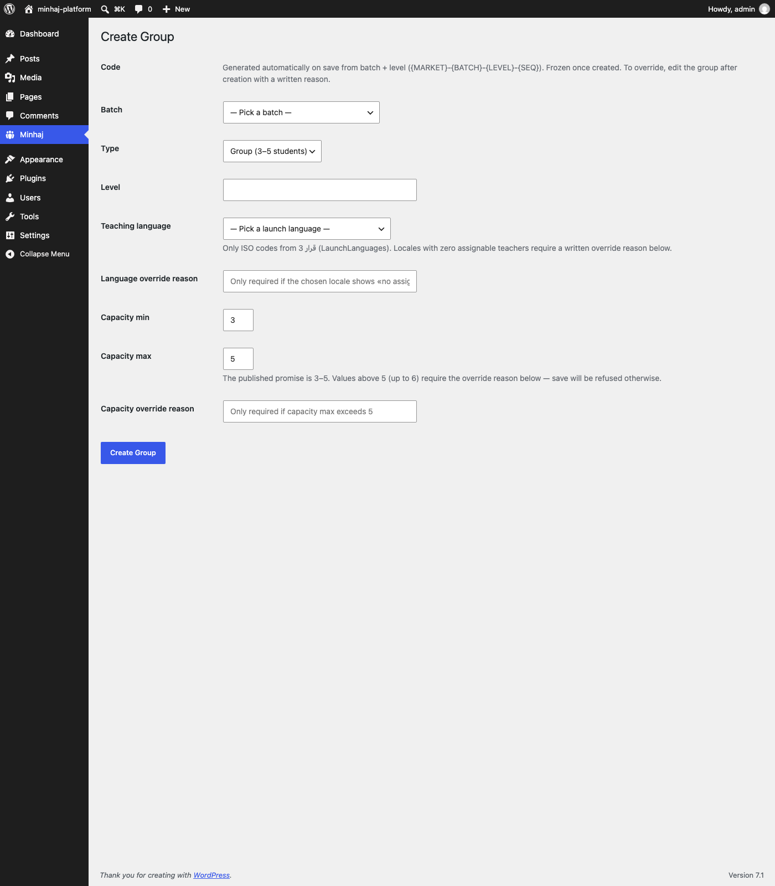
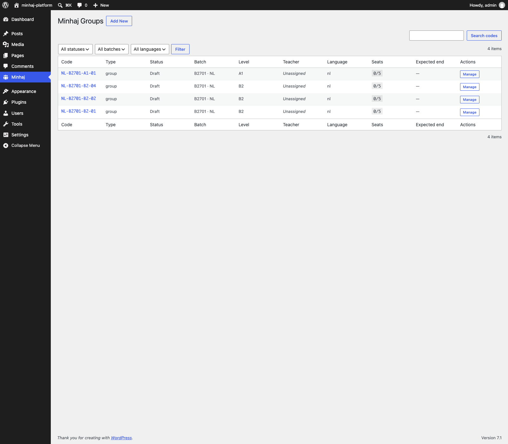

# تقرير · نقل الحرّاس إلى شاشة الإنشاء + عدّاد دائم للرمز

> **التاريخ:** 28 أغسطس 2026
> **النطاق:** ست إصلاحات كشفتها الجولة الثانية من الاستعمال البشريّ لواجهة المجموعات — لم تبلغ الحرّاسُ مسار الإنشاء لأنّ الحقول كانت لا تزال نصّاً حرّاً في النموذج، وتصحيح المصدر: لغات الإطلاق في `CLAUDE.md` كانت مخالفة **قرار 3**.

---

## 1 · ما نُفِّذ

### مصدر واحد للغات — قرار 3

- `CLAUDE.md` §الترجمة: قائمة اللغات الستّ صارت الآن `ar, en, fr, es, nl, de` مع إشارة صريحة إلى **قرار 3** كمصدر وحيد، ومنع تكرارها في مواضع أخرى. فتح لغة جديدة قرارُ سوق واعٍ (قرار 8 §5) عبر فلتر `minhaj_launch_languages` — لا تعديل مصفوفة.
- `Modules\Groups\Domain\LaunchLanguages` — الصنف الوحيد الذي يحمل القائمة، مع الفلتر ومرجع القرار.

### شاشة الإنشاء — كلّها قوائم

- **حقل `Code` مُلغى نهائياً** من نموذج الإنشاء. يُولَّد آلياً عند الحفظ، يُعرض للقراءة فقط بعده. **التجاوز الإداريّ** يقع في شاشة التعديل (لاحقاً) مع سبب مكتوب، لا هنا.
- **الدفعة قائمة منسدلة** تُشتقّ من `list_selectable_batches()` (`planned` + `open` + `running` فقط)، وتُعرَض بصيغة «B2701 · NL · starts 2027-01-01 (open)» — لا رقم داخليّ، ولا «Leave 0».
- **لغة التدريس قائمة** من `LaunchLanguages::all()`، مع تعليق تغطية المعلّمين لكل خيار: «AR — العربية · no assignable teacher». الاختيار المقفول لا يحلّ الاسم النصّيّ.
- **حقلا التجاوز صريحان في النموذج**: `capacity_over_promise_reason` و`language_coverage_override_reason` — يُملآن إن ورد ما يستوجب سبباً.
- نصّ «warning after saving» على السعة **مُزال**؛ الوصف الآن: «Values above 5 (up to 6) require the override reason below — save will be refused otherwise».

### رقم تسلسليّ لا يُعاد استعماله

- ترحيل جديد `CreateGroupCodeCounters` — جدول `minhaj_group_code_counters(batch_id, level, next_seq, updated_at)` بـ`PRIMARY KEY (batch_id, level)`.
- `GroupRepository::reserve_next_seq(batch_id, level): int` — `INSERT … ON DUPLICATE KEY UPDATE next_seq = next_seq + 1` ذرّيّ، يُرجع الرقم المحجوز.
- `GroupCodeFormatter::format` يستخدم `reserve_next_seq` بدل `count_groups_in_batch_level + attempt`. العدّاد يُبمّ **خارج** معاملة إدراج المجموعة؛ إن فشلت المعاملة يبقى الرقم محروقاً. **حذف مجموعة (حتى `DELETE` صريح) لا يُحرّر رقمها.**
- `count_groups_in_batch_level` عُدِّل ليشمل الصفوف المحذوفة كذلك — بقي كأداة تشخيصيّة، ولا يُستعمل في التوليد بعد الآن.

### قوائم بلا معرِّفات خامّة

- عمود `Batch` في القائمة يعرض «B2701 · NL» من `find_batch` لا `#41`.
- ملخّص المجموعة يعرض الشيء ذاته.
- مرشِّح Batch في أعلى القائمة يستعمل الصيغة نفسها.

### اختبار وحدة يبرهن أنّ الحارس في الخدمة لا في الواجهة

- `tests/Unit/Modules/Groups/GroupServiceGatesTest.php` يستدعي `GroupService::create` مباشرةً بلا واجهة:
  - locale بلا تغطية → `no_assignable_teacher_for_language`.
  - `capacity_max=6` بلا سبب → `capacity_over_promise`.
  - الاثنان معاً → بوّابة اللغة تسبق بوّابة السعة.
- الوجود المنفصل للاختبار هو التعبير الرسميّ عن: «حارس الواجهة يتجاوزه أيّ مستدعٍ آخر».

---

## 2 · الملفّات المتغيّرة

**جديدة:**
- `plugins/minhaj-core/includes/Modules/Groups/Domain/LaunchLanguages.php`.
- `plugins/minhaj-core/includes/Modules/Groups/Migrations/CreateGroupCodeCounters.php` (VERSION `20260830300002`).
- `tests/Unit/Modules/Groups/GroupServiceGatesTest.php`.

**معدَّلة:**
- `CLAUDE.md` — قسم i18n يشير إلى قرار 3 بصفته المصدر الوحيد.
- `plugins/minhaj-core/includes/Modules/Groups/GroupCodeFormatter.php` — يستعمل `reserve_next_seq`.
- `plugins/minhaj-core/includes/Modules/Groups/Module.php` — إدراج المهجرة الجديدة.
- `plugins/minhaj-core/includes/Modules/Groups/Repository/GroupRepository.php` — `reserve_next_seq`, `counters_table`؛ `count_groups_in_batch_level` يشمل المحذوف.
- `plugins/minhaj-core/includes/Modules/Groups/Admin/AdminController.php` — إعادة كتابة `render_new_page`، إسقاط `code` من `do_create`، عرض رمز الدفعة في شاشة العرض.
- `plugins/minhaj-core/includes/Modules/Groups/Admin/GroupsListTable.php` — `column_batch_id` ومرشِّح الدفعة يعرضان الرمز.
- `tests/Integration/groups-ui-fixes.sh` — AC-2 لدلالات العدّاد، **AC-6 جديد** لعدم إعادة الاستعمال بعد الحذف.

---

## 3 · معايير القبول والنتائج

### النتائج الحرفيّة (`composer test:82`)

```
PHPUnit 11.5.56 by Sebastian Bergmann and contributors.

Runtime:       PHP 8.2.33
Configuration: /app/phpunit.xml.dist

...............................................................  63 / 185 ( 34%)
............................................................... 126 / 185 ( 68%)
...........................................................     185 / 185 (100%)

Time: 00:00.242, Memory: 24.00 MB

OK (185 tests, 608 assertions)
```

### الاختبار التكامليّ (`groups-ui-fixes.sh`)

```
== Reset relevant tables + seed one batch ==
  BATCH=42

== AC-1 · create three groups back-to-back and see NL-B2609-A1-{01,02,03} ==
  CREATE_0=NL-B2609-A1-01
CREATE_1=NL-B2609-A1-02
CREATE_2=NL-B2609-A1-03
  ✓ codes generated in sequence: NL-B2609-A1-01, NL-B2609-A1-02, NL-B2609-A1-03

== AC-2 · retry-on-collision reserves the next slot from the counter ==
  RESULT=NL-B2609-A1-05
  ✓ retry reserved next counter slot: NL-B2609-A1-05

== AC-3 · capacity_max > 5 refused pre-save without a written reason ==
  WITHOUT=err:capacity_over_promise
WITH=ok
  ✓ capacity>5 without a reason refused with err:capacity_over_promise
  ✓ capacity>5 with a reason accepted

== AC-4 · language with zero coverage refused pre-save ==
  LANG=err:no_assignable_teacher_for_language
OVERRIDE=ok
  ✓ zero-coverage locale refused with err:no_assignable_teacher_for_language
  ✓ zero-coverage locale accepted with an override reason

== AC-5 · unscheduled-makeups CLI catches a no_show session that has no make-up row ==
  ORPHAN_SESSION=175
  --- CLI output ---
  
  == no_show sessions with NO make-up row (reconciliation gap) ==
  id	group_id	sequence_no	lesson_no	teacher_id	anchor_timezone	scheduled_start_utc
  175	42	1		42	UTC	2027-06-01 09:00:00
  ---
  ✓ CLI reported the orphaned no_show session (175)

== AC-6 · sequence never reuses a released slot ==
  BATCH=43
  CREATE_0=NL-B2701-B2-01
CREATE_1=NL-B2701-B2-02
CREATE_2=NL-B2701-B2-03
FOURTH=NL-B2701-B2-04
  ✓ deleted seq NOT reused — fourth group got NL-B2701-B2-04

GROUPS UI HARDENING PROOF PASSED
```

### دليل الواجهة

**شاشة الإنشاء (لقطة حقيقيّة من `/wp-admin/admin.php?page=minhaj-groups&view=new`):**



يظهر فيها:
- **Code** — سطر شرح فقط، بلا حقل إدخال.
- **Batch** — قائمة منسدلة «— Pick a batch —» تحمل «B2701 · NL · starts 2027-01-01 (open)».
- **Teaching language** — قائمة مع تعليق تغطية «no assignable teacher» لكل لغة (لعدم وجود معلّمين مسجَّلين في بيئة الاختبار).
- **Language override reason** — حقل مخصَّص للتجاوز مع placeholder صريح.
- **Capacity max** — الوصف الجديد بلا «warning after saving».
- **Capacity override reason** — حقل تجاوز صريح.

**دَورة كاملة عبر النموذج**: تسجيل دخول admin عبر curl، جلب nonce، إرسال POST للنموذج، ورؤية الصفّ المُدرَج في القاعدة:

```
NONCE=20bc3c3645 BATCH=41
HTTP=302
id	code	batch_id	teaching_language	capacity_max
396	NL-B2701-A1-01	41	nl	5
```

الرمز `NL-B2701-A1-01` مولَّد آلياً بعد الحفظ — لم يُرسله العميل.

**شاشة القائمة بعد الإنشاء:**



عمود **Batch** يقرأ «B2701 · NL» على كل الصفوف، لا `#41`.

---

## 4 · ما أُجِّل

- **شاشة التعديل مع تجاوز الرمز**. القاعدة (تجاوز الرمز بسبب مسجَّل) موجودة في `GroupService::create` عبر `code_override_reason`، لكن الشاشة التي تسمح بذلك لم تُبنَ بعد — تنتظر مواصفة صريحة لدَورة التعديل.
- **إغلاق مجال `Level`**. الحقل ما زال نصّاً حرّاً؛ ينتظر ثابتاً `A1..C2` (CEFR) أو ما يعادله يُحسم في المواصفة.

---

## 5 · أسئلة مفتوحة

- **هل `ui_locale` للطالب مقفولٌ على القائمة نفسها؟** حالياً `LaunchLanguages` يخدم `teaching_language`. إن أفتينا أنّهما مجالان مختلفان (لغة تعليم ≠ لغة واجهة وليّ الأمر)، وجب إنشاء `Domain\UiLocales` وإلا نستعمل `LaunchLanguages` للجميع. CLAUDE.md ينصّ الآن على «إن اختلفتا فذلك افتراقٌ يستوجب تسبيكه في المواصفة قبل الشيفرة».
- **تنبيه في الواجهة عند اختيار لغة بلا تغطية**. الآن التعليق نصّيّ فقط (`no assignable teacher`)؛ يمكن لاحقاً إظهار badge أحمر أو تعطيل الخيار مع رابط لفتحه بسبب مسجَّل.
